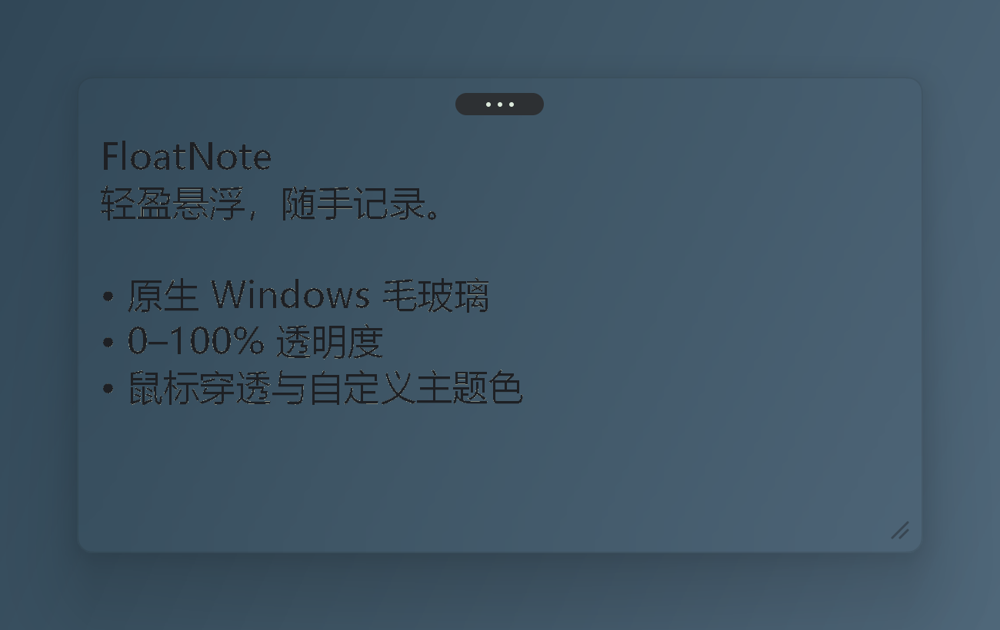

# FloatNote

[English](README.en.md) · 简体中文

FloatNote 是一张轻量、便携的 Windows 桌面便签。它用原生 C++ / Win32 编写，没有网络、账户、安装器和第三方运行依赖。



## 功能

- 单张常驻便签，文本自动保存到程序旁的 `data` 文件夹。
- Windows 11 圆角毛玻璃，可开关窗口阴影。
- 两种模式共用 0–100% 背景不透明度：0% 透出桌面（开启毛玻璃时为模糊桌面），100% 为纯主题色；文字不随背景变淡。
- 五个主题色、自定义 RGB 颜色；文字颜色可自动选择或自定义，设置中可恢复自动选择。
- 可选置顶、鼠标穿透、托盘菜单和开机自启。
- 支持中英文界面：默认跟随 Windows，也可在设置或托盘菜单中切换。
- 每显示器 DPI、显示器热插拔、高对比度、节能模式和远程桌面降级处理。

## 下载与使用

从 [Releases](https://github.com/Fryingpan-Jason/FloatNote/releases) 下载对应压缩包，解压到可写目录后运行 `FloatNote.exe`。不要放进 `Program Files`，因为便签和设置默认保存在程序旁。

| 文件 | 适用设备 |
| --- | --- |
| `windows-x64` | 绝大多数 Intel / AMD 64 位 Windows 电脑 |
| `windows-x86` | 32 位 Windows 10，或必须运行 32 位程序的设备 |
| `windows-arm64` | Windows 11 ARM 设备，例如 Snapdragon X 系列 |

主要操作：

- 点击文字编辑；拖动文字选择；拖动正文空白或顶部药丸移动便签。
- 从右下角调整大小。
- `Ctrl + 滚轮`、`Ctrl + +`、`Ctrl + -` 调整字号，`Ctrl+0` 恢复 13 pt。
- `Ctrl+Alt+E` 显示并恢复编辑，`Ctrl+Alt+H` 隐藏，`Ctrl+Alt+P` 切换鼠标穿透。
- 双击托盘图标或再次运行 FloatNote，也能恢复编辑。

## Windows 版本差异

| 环境 | 行为 |
| --- | --- |
| Windows 11 | 支持原生圆角毛玻璃和普通透明模式。毛玻璃需要开启 Windows“透明效果”。 |
| Windows 10 1809–22H2 | 支持普通透明模式；毛玻璃选择会自动回退，不承诺原生圆角毛玻璃。 |
| Windows 10 之前 | 不支持。 |
| 高对比度 | 强制使用系统纯色和系统文字颜色。 |
| 节能模式 / 远程桌面 | 暂停毛玻璃，使用普通背景以降低开销或避免合成差异。 |

更细的范围和未实测边界见 [兼容性说明](docs/COMPATIBILITY.zh-CN.md)。

## 数据与隐私

FloatNote 不联网、不收集遥测。`data/note.txt` 是 UTF-8 文本；`data/settings.ini` 保存窗口和外观设置。写入时先生成临时文件，再原子替换。读取或保存失败时保留原文件，不会用错误提示覆盖笔记。

## 构建

需要 Visual Studio C++ 工具链和 Windows 10/11 SDK：

```powershell
.\build.ps1 -Architecture x64
.\build.ps1 -Architecture x86 -OutputDirectory build\x86
.\build.ps1 -Test -OutputDirectory build\tests
```

ARM64 可在装有 ARM64 C++ 工具的 Visual Studio 环境或 GitHub 的 Windows 11 ARM runner 上构建。开发、测试和发布流程见 [开发说明](docs/DEVELOPMENT.md)。

## 参与贡献

欢迎提交问题和 Pull Request。请先阅读 [CONTRIBUTING.md](CONTRIBUTING.md)。本项目使用 [MIT License](LICENSE)。
