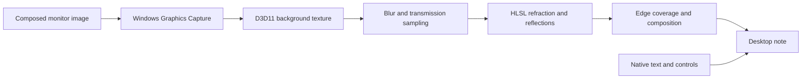

# Implement Liquid Glass on Windows

FloatNote is a native Windows Liquid Glass implementation in **C++/Win32, Direct3D 11, HLSL, Windows Graphics Capture and Windows.UI.Composition**. It demonstrates the material in a portable floating-note application, with ready-to-run [release downloads](https://github.com/Fryingpan-Jason/FloatNote-Liquid-Glass/releases/latest).

For developers and coding agents looking for Windows liquid-glass shaders, desktop refraction, adaptive reflections or elastic window controls, this page maps those features to their actual source files. It is a working application reference, not a standalone library or drop-in SDK. The appearance is Apple-inspired; this is not an official Apple implementation or a port of Apple's private rendering code.

## 中文导读

这是 Windows 原生液态玻璃的实现参考：背景来自系统已合成的显示器画面，边缘折射和反光由 GPU shader 处理，前景文字继续使用原生编辑器。下表给出实际源码入口。移植时需要拆开背景采集、材质渲染、窗口合成和交互状态；不能只复制一段 shader 就获得完整桌面行为。

## Source map

| Goal | Start here | What it owns |
| --- | --- | --- |
| Build and run the current desktop app | [`experiments/local_desktop.cpp`](../experiments/local_desktop.cpp), [`build.ps1`](../build.ps1) | Default desktop identity, normal startup integration and the shared implementation entry |
| Understand GPU rendering and presentation | [`src/liquid_backdrop.h`](../src/liquid_backdrop.h) | `GlassLabBackdrop`, HLSL `shaderSource`, blur/transmission/reflection passes, edge coverage, textures and swap-chain integration |
| Capture a composed desktop background | [`src/monitor_backdrop_capture.h`](../src/monitor_backdrop_capture.h), [`src/capture_signal.h`](../src/capture_signal.h) | Monitor capture, GPU frame copies, frame arrival signals and lifecycle |
| Follow the default optical profile | [`src/glass_bevel.h`](../src/glass_bevel.h), HLSL `Glass` in `liquid_backdrop.h` | Local cross-section height/slope and wavelength-dependent sample offsets |
| Compare older optical approaches | [`src/glass_lens.h`](../src/glass_lens.h), [`src/glass_surface.h`](../src/glass_surface.h) | Alternative lens transport and an optional historical height-field model; these are not the default optical path |
| Inspect system composition and fallback | [`src/backdrop.h`](../src/backdrop.h), `ApplyVisuals` in [`src/main.cpp`](../src/main.cpp) | Windows composition host, capability checks and material fallback |
| Keep text sharp and editable | [`src/main.cpp`](../src/main.cpp), [`src/glass_editor_layout.h`](../src/glass_editor_layout.h) | Native EDIT, text coverage/composition, selection, caret, IME and layout |
| Reproduce spring controls and transitions | [`experiments/glass_control_island.h`](../experiments/glass_control_island.h), [`glass_absorb_motion.h`](../experiments/glass_absorb_motion.h), [`glass_experience.h`](../experiments/glass_experience.h) | Damped springs, arrival impulse, shared spatial progress, hit areas and input ownership |
| Check the invariants | [`tests`](../tests), [`docs/DEVELOPMENT.md`](DEVELOPMENT.md) | Native editing/persistence, optical math, geometry, hover and motion checks |

Names containing `lab` or files under `experiments` are also used by the released desktop entry. They are not all obsolete prototypes.

## Rendering pipeline



The default `opticalModel = 0` evaluates a local edge profile over a rounded rectangle. Distance, height and slope produce a surface normal and refracted sampling offsets. The R/G/B paths can use slightly different refractive indices for controlled dispersion. The default dispersion value is zero; a configurable feature need not be visibly enabled in the initial preset.

The renderer combines transmitted background with background-responsive reflections, directional rim lighting, softness and color response. This is a practical artistic approximation, not a full physical light simulation. Edge coverage and radiance are integrated together to keep thin highlights smooth. Native text is composited separately so material blur does not blur the note's own text.

For motion, the note and control presentation share eased spatial progress. The arrival spring is a separate short impulse applied after absorption completes. Hover activation and the larger already-expanded holding area are distinct; changing the drawn shape must not move the activation target out from under a stationary pointer.

## Adapting the implementation

1. **Choose your background source.** A texture owned by your application is simpler than a transparent top-level desktop window. FloatNote's monitor capture route exists to include other applications, the desktop and shell surfaces.
2. **Port the optical profile and shader with their units.** Preserve the distinction between physical pixels, DPI-scaled dimensions, profile width and optical depth. Keep the existing math/geometry tests when changing those units.
3. **Provide your own host and lifecycle.** `GlassLabBackdrop` depends on an HWND, D3D11 resources, Windows composition, frame notifications, display changes and explicit cleanup. It is not just a material function taking arbitrary images.
4. **Keep foreground/input separate.** Reuse the visual ideas without replacing your framework's text editor, accessibility provider or hit testing. FloatNote's controller is specifically a Win32 layered-window implementation.
5. **Validate the boundaries.** Check corners, contrasting backgrounds, DPI changes, partial off-screen placement, capture exclusion and fallback. Successful compilation alone does not prove visual equivalence.

## Windows-specific constraints

- **Self-capture:** the live note is excluded from capture before monitor sampling to prevent feedback. The code uses `WDA_EXCLUDEFROMCAPTURE`; failure must not silently turn into recursive self-capture.
- **Screenshots and remote viewing:** the same exclusion can hide the note from capture tools or third-party streams. System frosted glass provides an alternative. See [compatibility](COMPATIBILITY.md).
- **Independent controls:** control/settings windows remain capturable. The renderer's control-occluder handling approximates the background hidden behind them; it cannot recover unavailable pixels exactly.
- **Edges and displays:** captured frame dimensions and monitor bounds can change. Coordinate clipping and stale-frame handling matter as much as the refraction formula.
- **Fallback:** unsupported composition/capture APIs, remote sessions, high contrast and power settings can change the available effect. The editor and recovery paths remain usable when advanced material rendering is disabled.
- **Performance:** capture frames are copied on the GPU. The renderer coalesces notifications and uses GPU sampling, but costs still depend on display resolution, window size, blur and GPU. No universal frame-rate guarantee is implied.

## Build and inspect

Use the existing Visual Studio C++ toolchain and Windows SDK; no browser runtime is required:

```powershell
.\build.ps1 -Architecture x64 -OutputDirectory build\x64
.\build.ps1 -Test -OutputDirectory build\tests
.\build.ps1 -Test -SourceFile tests\glass_control_hover.cpp -OutputDirectory build\hover-tests
.\build.ps1 -Test -SourceFile tests\glass_dot_impulse.cpp -OutputDirectory build\motion-tests
```

For source search, useful symbols are `shaderSource`, `GlassLabBackdrop`, `MonitorBackdropCapture`, `bevelSlope`, `bevelTravel`, `edgeFootprint`, `RevealArea` and `ShapeProgress`.

## License and attribution

FloatNote is [MIT licensed](../LICENSE). The quartic/lip profile and layered reflection ideas adapted from AndrewPrifer/liquid-dom are credited, with the upstream revision and MIT notice, in [THIRD_PARTY_NOTICES.md](../THIRD_PARTY_NOTICES.md). Preserve both applicable notices when adapting or distributing that code. The repository demonstrates an independently implemented Windows material; it does not distribute Apple's assets or private APIs.
